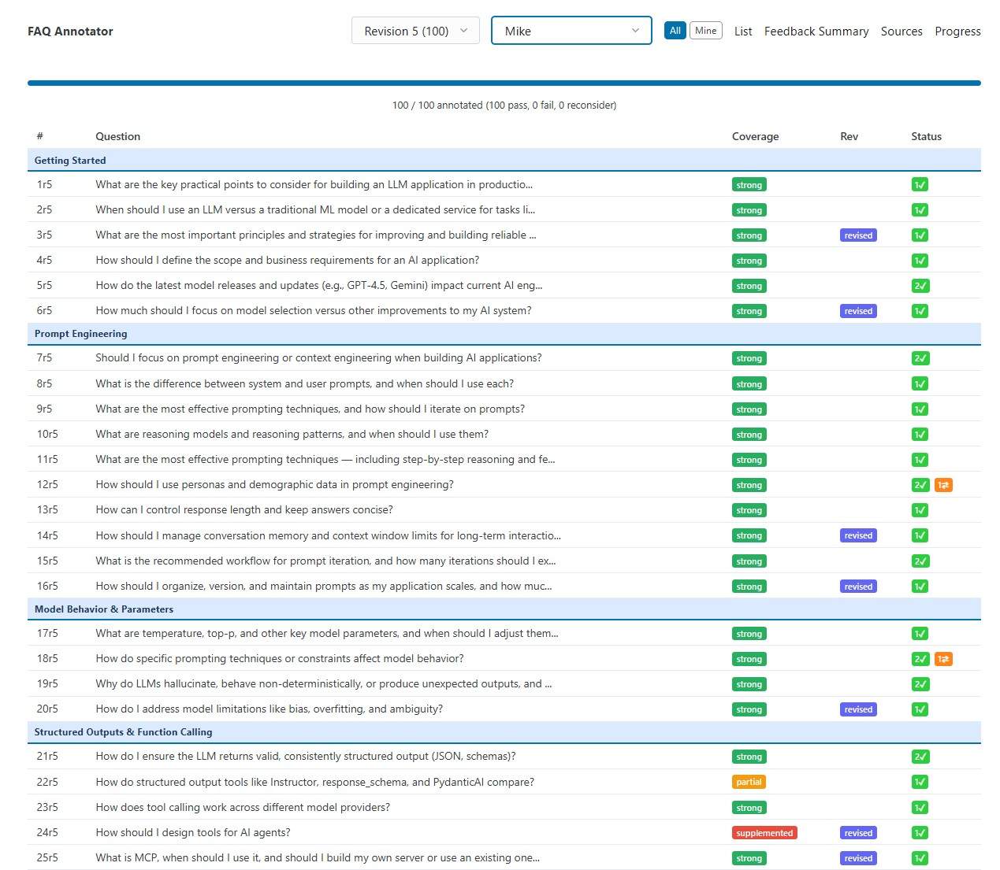

# Top 100 Q&A — Process & Methodology

This repo documents how ~1,300 Discord threads from an AI engineering course were distilled into a curated *Top 100 Q&A* using LLM pipelines, human review, and custom tooling.

It's intended as a reference for anyone building similar content-generation workflows — particularly those combining LLM automation with human editorial oversight.

## What's here

### Presentation (`top_100_slidev/`)

A slide deck walking through the end-to-end process, from raw Discord extraction through annotation and iteration. The exported PDF is included.

### Process narrative (`project_narrative.md`)

A detailed written account of the methodology: how questions were extracted, classified, consolidated, answered, and refined. Includes inline prompt excerpts showing the key design decisions at each stage.

### Example prompts and skills (`examples/`)

Working artifacts from the project, useful as templates or reference implementations:

- **`prompts/faq_one-shot_prompt.md`** — The prompt used for initial FAQ extraction: building a subtopic taxonomy from lecture content, then mapping and normalizing raw student questions against it.

- **`prompts/prompt_templates.py`** — Python prompt templates for the LLM classification pipeline. Two stages are shown:
  - *Stage 2 (Preprocessing)*: Classifying Discord messages as questions vs. non-questions, and categorizing by Content / Logistics / Other.
  - *Stage 4 (Cluster Refinement)*: Grouping similar questions into canonical FAQ entries by intent, with specificity guidance for when to generalize vs. keep tool-specific names.

- **`examples/skills/faq-answer-generator/`** — A Claude Code skill that drove answer generation and revision. Includes:
  - `skill.md` — The skill definition: workflow steps, source material tiers, coverage assessment criteria, revision pass logic, and rules for source attribution.
  - `references/style-spec.md` — The style guide extracted from hand-written pilot answers: target length, structure, tone, and sourcing conventions.
  - `references/pilot-examples.md` — Two calibrated examples used as few-shot references for answer quality.

## Key ideas

A few decisions shaped the project and are worth examining in the examples:

**Intent-based grouping over topic-based grouping.** Questions about the same tool but with different intents (conceptual vs. troubleshooting) were kept separate. The clustering prompts encode this as an explicit rule with worked examples.

**Specificity heuristic.** "Deciding *whether/which*" questions get generalized ("vector databases"); "asking *how*" questions keep the specific name ("ChromaDB"). This prevented both over-merging and under-merging during consolidation.

**Style extraction from human-written pilots.** Rather than describing the desired tone abstractly, a style spec was reverse-engineered from 10 hand-written answers. The spec and two pilot examples together anchored the LLM's output more effectively than either alone.

**Tiered source material with coverage tracking.** The answer-generation skill ranked sources by reliability and required each answer to self-report its coverage level (strong / partial / supplemented), making thin spots visible for human review.

**Iterative annotation loop.** Four rounds of generate-annotate-revise, with a separate skill handling revisions based on reviewer feedback. The revision skill received the current answer text plus comments, not just the question — so it could make targeted edits rather than regenerating from scratch.

